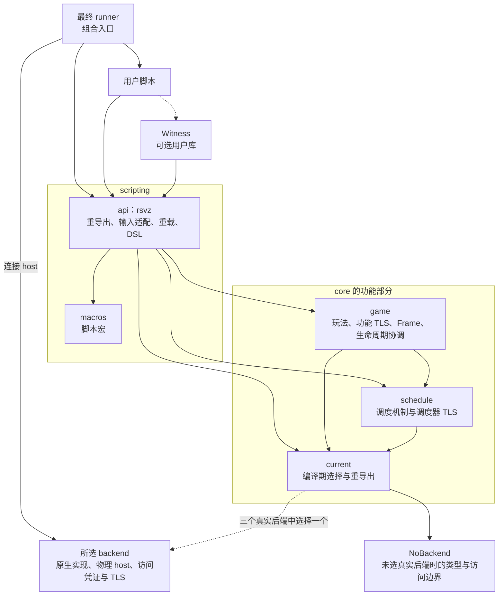
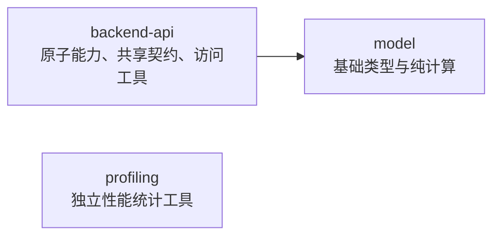

# RustVsZombies 架构

本文是项目架构意图、crate 职责和代码放置规则的仓库内真源。当前 API、
依赖和命令仍以源码、Cargo 清单、测试及 CLI `--help` 为准；可执行架构门禁
位于 `crates/scripting/api/tests/architecture.rs`。

## 依赖边界

当前操作由普通 core 函数提供，状态由所属功能持有；scripting 负责输入适配、
重载及 DSL 表达式。独立 rsvz-runtime 包、Runtime／Current*Runtime 绑定和
rsvz::current 整体门面已删除。架构测试检查 host、组合根、依赖方向及状态归属。
阶段验证记录见[重构记录](history/current-functions-progress.md)。

### 依赖图与基础依赖

箭头 `A → B` 表示 Cargo 直接依赖，不表示每次函数调用必须经过所有层；虚线表示可选或由 feature 启用的依赖。主图省略基础公共 crate 的依赖，随后用表补全；第三方库、backend 文件夹内部依赖和测试依赖不展开。



基础公共依赖如下；✓ 表示允许且以当前直接依赖为基线，最终仅保留实际需要的依赖；— 表示不建立该直接依赖：

| 依赖方 | backend-api | model | profiling |
|---|:---:|:---:|:---:|
| scripting/api | ✓ | ✓ | ✓ |
| game | ✓ | ✓ | ✓ |
| schedule | ✓ | ✓ | ✓ |
| 具体 backend | ✓ | ✓ | 按实际需要 |
| backend-api | — | ✓ | — |
| model | — | — | — |
| profiling | — | — | — |



- backend 可以直接依赖 model，无需经过 backend-api 转发。profiling 只使用标准库；model 保留基础值及适合其职责的纯计算，不要求所有纯算法迁入 model。
- `scripting/api → current` 用于 feature 转发、具体能力约束和脚本宏接入所需类型，不意味着 API 保存 runtime 状态或每个函数都增加包装。宏生成的调用路径不构成 macros crate 对相应实现 crate 的直接依赖。
- `schedule → current` 仅在当前调度操作确实需要选中 backend 时保留，例如当前波长控制；若相关操作已不直接使用 current，则删除该依赖及对应 feature 激活。不得仅为减少图上一条边增加 driver、注册表或转发层。
- 图表描述本轮沿用的分层关系，不强制保留实现完成后已无用途的依赖；必要的删除同步到图表与 Cargo 图检查。不得新增反向依赖，基础层仍保持上述边界。
- host 通过传入的 `DispatchEntry` 调用脚本执行通路，这种运行时调用不产生 backend 对 game／scripting 的 Cargo 依赖。最终 runner 仅完成组合，tooling 不进入运行产物图；Witness 仍通过 rsvz 使用 core，tooling 构建不选择 backend。

### 各层职责与新增机制归属

- scripting/api 负责 core 重导出、必要重载、植物及其他脚本简写、Rust 输入适配、DSL 表达式与展开，以及少量脚本入口接入。适合直接使用的 core 接口直接重导出，不增加同签名包装；core 不依赖脚本别名，遵循正常 Rust 命名约定。
- 波次选择、表达式分组等注册期语法状态可以留在 scripting；游戏运行状态、动作和可复用玩法规则属于相应 core 功能。不以 scripting 必须无状态或文件必须很短作为验收标准，也不为减少 API 行数将整套 DSL 搬入 game。
- `Frame`、`PlantRef`、`ZombieRef` 由 game 拥有；原生 token 与访问 TLS 由具体 backend 拥有，backend 不引用 game 的公开 Frame 类型。backend-api 只提供无全局实例的访问工具、原子契约及基础错误值。
- schedule 拥有队列、普通回调执行结果和局部中止信号的识别机制；game 拥有日志输出、操作失败记账及测算解释。通过返回结果或控制信号传递失败，不为报告错误建立 `schedule → game` 或 `backend → game`。
- game 协调注册、Opening、派发、reset 和退出等既有执行阶段；cob、ice_filler 等玩法组件保持并列，按需初始化，不建立统一组件初始化顺序、中央 reset 名单或独立 runtime crate。

### 依赖边界

| 部分 | 允许的项目内依赖与职责 |
|---|---|
| model | 保持基础类型与纯计算，不依赖 current 或后端 |
| backend-api | 依赖 model；提供原子能力、共享边界契约和小型访问工具，不依赖上层 |
| profiling | 只使用标准库；作为明确的基础工具例外供各层使用 |
| 具体 backend | 文件夹外允许直接依赖 backend-api、model，以及实际需要的 profiling；不依赖 game、schedule、current、scripting |
| current | 位于 `crates/core/current`，只选择具体 backend 的类型和入口 |
| schedule | 依赖 backend-api、model、profiling；实际需要所选 backend 的当前调度操作可依赖 current |
| game | 依赖 backend-api、model、schedule、profiling、current；拥有玩法和生命周期协调 |
| scripting | 依赖 core，并允许 api 依赖同层 macros；不被实现层反向依赖 |

最终 runner 按用户脚本组合根处理，继续组装脚本、rsvz 和所选 backend；tooling 不进入最终产物图。

generated root 依赖真实 user package、rsvz 的 backend selector 和所选
backend，只将 user_script::__rsvz_dispatch 交给 backend host；仅 PE 需要启用 host feature。
物理循环通过传入的 DispatchEntry 调用 game 的执行路径，不形成反向 Cargo
依赖。current 是唯一具体 backend selector；API 只转发 feature，源码不按
backend 分支。current 不拥有 TLS 或执行策略，tooling 不进入最终产物图。

## Crate 职责

| 路径 | 包 | 拥有的职责 |
|---|---|---|
| `crates/core/model` | `rsvz-model` | 后端无关的类型、ID、枚举、值对象、配置、快照和事件。 |
| `crates/core/backend-api` | `rsvz-backend-api` | 原子事实和动作、共享错误、通用 artifact、Opening 边界契约和无全局实例的 BackendScope 工具。 |
| `crates/core/schedule` | `rsvz-schedule` | 相互独立的 Timeline、TickScheduler、EventDispatcher、state-hook registry 及其当前实例 TLS；机制不反向调用 game 策略。 |
| `crates/core/game` | `rsvz-game` | Opening、lineup、Bench/Measure、lifecycle/reset/session control、diagnostics、注册事务，以及玩法普通操作和各功能自持 TLS。 |
| `crates/core/profiling` | `rsvz-profiling` | 轻量 profiling primitives；具体 backend 可依赖它，但不得借此承载 game/runtime 语义。 |
| `crates/core/current` | `rsvz-current` | 只按 feature 选择 CurrentBackend、DispatchEntry 和 backend-local result 类型；未选真实 backend 时选择 NoBackend。 |
| `crates/backends/none` | `rsvz-no-backend` | 无原生依赖的占位 backend；只提供基础错误、访问及 dispatch 类型，不实现游戏能力或保存游戏状态。 |
| `crates/scripting/api` | `rsvz` | 植物简写、便捷别名、必要重载、low DSL 和 core 重导出；输入转换为 core 规范类型，单签名操作不重复包装。 |
| `crates/scripting/macros` | `rsvz-macros` | `#[rsvz::script]`、`#[rsvz::state_hooks]` 等过程宏。 |
| `crates/backends/pvz_1_0_0_1051/abi-macros` | `rsvz-abi-macros` | 为 1051 已验证的非标准 ABI 生成 Rust wrapper，并可选地对原版 EXE 做静态校验。 |
| `crates/backends/pvz_1_0_0_1051/injected` | `rsvz-pvz1051-injected` | 1051 raw ABI、地址、布局、hook、patch、数据级 Board reset、物理 lifecycle/host、wire/I/O、handle 和 capability 实现。 |
| `crates/backends/pvz_1_0_0_1051/injector` | `injector` | 外部进程发现、版本验证、远程内存、DLL 注入与卸载。 |
| `crates/backends/pvz_1_0_0_1051/tooling` | `rsvz-backend-1051-tooling` | 生成 manifest-only final runner、调用 Cargo、启动 injector 和展示 control result。 |
| `crates/backends/pvz_emulator/pe-rs` | `pe-rs` | 相邻 PvZ-Emulator 的 C++ bridge、raw 转换和安全 world wrapper。 |
| `crates/backends/pvz_emulator/backend` | `rsvz-pvz-emulator-backend` | PE capability、world/worker、物理 update/reset、watchdog、profile、host wire/I/O 和 output。 |
| `crates/backends/pvz_emulator/tooling` | `rsvz-pvz-emulator-tooling` | 生成 manifest-only final runner、调用 Cargo、启动 runner 和展示 control result。 |
| `crates/backends/pvz_portable/pvzp-rs` | `pvzp-rs` | PvZ-Portable 的 bindgen raw 布局、借用 wrapper、窄 C ABI 和全部 unsafe native 边界；普通实体字段由 Rust 直接读取原生槽位。 |
| `crates/backends/pvz_portable/backend` | `rsvz-pvz-portable-backend` | Portable capability、脚本 host/生命周期、NativeEventSink、wire/I/O 和 output；原生修改器属于游戏。 |
| `crates/backends/pvz_portable/tooling` | `rsvz-pvz-portable-tooling` | 生成 manifest-only `cdylib` 插件，驱动 MSVC 或 UCRT64/MinGW 的固定 Portable 宿主构建，并在启动时选择要加载的脚本 DLL。 |
| `crates/tools/rsvz-cli` | `rsvz-cli` | `inject-1051`、`run-1051`、`run-pe`、`run-portable`、`prepare-script` 的薄命令入口和裸脚本准备。 |

三个 fixed final entry 都只是 composition root：1051 的两个
`extern "system"` 导出、PE 的 `main` 或 Portable 插件的固定入口只把
`user_script::__rsvz_dispatch` 转交各自的 backend host。

基本 live 测试仍是普通用户脚本。1051 的 `run-1051` 与 Portable 的
`--close-game-on-finish` 只在各自 tooling 中增加专用子进程、临时存档、期限和
卸载验证；原有物理 host、dispatch 和报告协议不变。两端复用的 Windows 文件复制、
进程句柄及模块枚举辅助代码不包含 host、游戏循环或 backend 选择；Python 入口
仅串行调用命令、保存日志并核对模板未变，不进入最终运行产物的依赖图。

`extensions/rsvz-witness` 是独立 Cargo workspace 中的可选编译时脚本扩展，
不被 `rsvz`、game、backend host 或主 CLI 依赖。它只依赖公开
`rsvz` 表面和自己的编码/tooling 依赖；用户脚本显式依赖并调用
`rsvz_witness::start()?` 或 `start(options)?`。capture feature 只启用扩展自己的
采集模块，backend 由最终 runner 选择；tooling 通过 NoBackend 使用相同 rsvz
公共类型，不构建原生 backend。schema、canonical capture、artifact reader、
comparator、replay 和 `witness-diff` 均由该扩展拥有。

TickScheduler 不携带 backend 或错误类型参数，只存储普通 `TickMeta` 回调，
结果统一使用 RuntimeError。当前 tick TLS 不引用选定 backend；玩法任务在 game
注册，不能恢复 backend-aware 回调变体或为了测试增加第二种调度器。

当前实体 ID 读取直接返回 LiveValue、Option 或布尔值，不公开用于恢复物理读取
故障的 try_*；缺失 ID 保留原缺失表达。操作失败通过 schedule 的局部中止信号
退出执行回调，再由 game 记账/输出；读取、遍历和 backend guard 不消费信号。
普通日志中 logger 的局部中止继续传播到执行边界；报告既有失败时的 logger
二次失败走 emergency output，保留原始错误。选择真实 backend 时要求 panic=unwind，
由 current 集中检查；NoBackend 的默认日志直接写 stderr。

### Board 访问和错误边界

backend 是唯一、受控构造的 ZST token。合法 token 的生命周期保证 owner 与
App（PE 为 world）存活；它不表示 Board 一定存在。普通 at、tick 和 Immediate
回调不额外绑定 Board；Playing／Active 仍由实际调度阶段筛选。

Frame 保存共享 `&CurrentBackend`，创建时不读取 Board。PlantRef／ZombieRef
保存同一 backend 借用与 GAT handle，实际字段和动作直接走 backend-api trait。
纯 Frame 回调可以执行；第一次 Board 查询失败时沿既有局部中止策略退出。
没有安装 token 时不能创建 Frame。普通无参操作仍通过 TLS 获取 token 并保留
共享／独占借用保护；少量维护实体生命周期的私有 helper 接收 backend 借用。

Board、池和 spawn 地址按需查询，不放进 token、Frame、迭代器或 TLS 缓存。
迭代器保留 backend 借用、游标、固定扫描上限及筛选标志。获得有效 handle 后，
HP、坐标、状态与 ID 读取保持直接返回值，不重新校验 ID、世代或 Board。
同帧死亡与原地编辑不会回收槽位，可使用共享访问；update、实际回收、reset
和场景替换要求独占。PE world/state 的实际 RefCell 借用保护仍保留。

植物／僵尸及占用槽位遍历、ID 查找、地形物／投射物遍历、阳光和自然阳光、
波数、池容量／数量与模仿者后继查询返回 Result。ID 查找返回
`Result<Option<Handle>, Error>`：缺 Board 是错误，缺对象是 `Ok(None)`。
不能以空迭代器、零或 None 隐藏读取失败。子对象、池存储、索引／容量、完整
ID 匹配及操作参数仍须验证；内嵌字段的地址判空和已被完整 ID 相等蕴含的
重复世代判断可以裁剪。Board 存在不等于 Playing，原有业务阶段要求继续保留。

访问 epoch 只在调度边界判断 sample 是否可能失效，不做逐字段版本检查。
公开 TickMeta 不是内存安全凭证；独占操作后按真实 phase／clock 重新判断后续
任务资格。reset 请求保留延迟执行，直接独占操作无借用冲突时可同步执行。
Witness 仍按短共享条件读取、独占补偿、共享采样的原时序执行。

game 使用既有局部中止机制处理必要读取失败；重复任务保留、后续任务继续、
部分提交不回滚，动作拒绝仍是领域结果。Frame、visitor 和 backend guard
不消费中止信号。独立 pe-rs／pvzp-rs 的安全 API 保留跨 world／对象归属检查，
不自动继承 backend token 契约。实现和验证见
[无缓存访问迁移记录](history/no-board-access-progress.md)。

### 无原生后端构建与生产条件编译

`rsvz`、game、schedule 正常依赖 current；未选择任何 `pvz-*` feature 时，
`CurrentBackend` 为 `NoBackend`。纯类型、算法、调度容器和无需访问游戏的
操作正常编译和测试；需要游戏能力的普通函数和 callable 仅在实际能力约束
满足时可调用。NoBackend 不提供植物、时钟或动作 trait，不用返回零值或成功
来模拟游戏，也不替代真实 PE 业务测试。

core 除 current 外以及 scripting API 的生产代码不得出现 `cfg`、`cfg_attr`
或 `cfg!`，宏模板同样适用。测试专用条件允许保留；`all(test, ...)` 仍仅编译
测试代码，`any(test, feature = ...)` 会包含生产代码，因此禁止。后端选择、
互斥检查与原生配置检查集中在 current；业务差异通过实际能力约束和已有数据
表达，不添加第二套泛型业务实现或集中能力表。

自动收集根据 `AUTO_COLLECT_IS_NOOP` 和 `ITEMS_CAN_EXIST` 避免无意义任务；
SmartRemove 默认使用所有真实后端已有的视觉能力，显式无高亮入口仍然存在。
不再保留独立的运行模式、收集或视觉 Cargo feature。NoBackend 的 Cargo 图
允许包含 current 和 none，但不得包含真实 backend、pe-rs 或 pvzp-rs。

## 代码放置顺序

1. 基础类型、枚举、ID、配置或事件数据放 `rsvz-model`。
2. backend 能原子读取或执行的事实/动作放 `rsvz-backend-api` trait，并在
   各个适用的具体 backend 中分别实现。
3. 由原子事实组合出的游戏规则、批量流程、Opening、测算 trial/reducer 或
   manager 状态机放 `rsvz-game`。
4. lifecycle、opening/reset、artifact/session job、stop/fatal 和 manager
   resource 类型放 `rsvz-game`；Timeline/Tick/Event/Hook 机制放
   `rsvz-schedule`。TLS 由功能实现所在模块拥有，game 只协调已有框架阶段。
5. 用户语法、字符串简写、必要重载和 DSL lowering 放
   `crates/scripting/api`，但 canonical 行为只在 core 保留一份。
6. 地址、ABI、hook、patch、raw layout、PE bridge、world/worker 和物理
   wire/I/O 留在具体 backend。
7. 生成、构建、启动和展示属于对应 tooling；CLI 只委托。
8. 可复用但没有游戏语义的底层机制才放 `support`。

效果卡的纯时间计算与错误数据位于 game 的 `logic/card_timing`；`cards::effect`
拥有昼夜/模仿者/存冰的跨回调植物记录、执行动作和定时清理，并向调用方已有的
批量注册通路提供回调。该模块是前端接入的内部实现。scripting 的效果 Leaf
只适配 Expr、别名、输入和波次错误上下文，沿用同一批次的校验与提交规则。

backend-api 的原子事实必须与调用用途无关。例如 kind、phase、坐标和状态位
各自回答游戏的客观状态；backend 不得知道 core 将其用于碰撞、运动预测还是
其他规则。禁止按用途新增 `ZombieGeometryFacts`、`*Snapshot`、`*Bundle`、
geometry input 等聚合接口。

backend-api 的实体能力按 plant、zombie、projectile、seed、grid_item、item
分别归入同名模块，各 trait 仍按能力拆分；全局规则、场景及刷怪表留在
对应职责模块。item 是原生 Coin 可收集对象，grid_item 是墓碑、梯子等格子
物件，两者不合并。实体字段与动作默认接受当前 backend 借用内有效的 handle，
方法名不带 `_handle`。跨帧保存 ID，通过 `plant(id)` / `zombie(id)` 重新
解析；`plant_id(handle)` / `zombie_id(handle)` 取得 ID。确有需要的 ID
动作版本使用 `_by_id`，不为每个 handle 方法增加对应包装。上层脚本的
ID 便利接口不受此命名约定影响。seed 使用既有 SeedSlot，不新增 SeedId。
植物字段读取必须显式实现，不以 trait 的零值／None 默认实现掩盖能力缺失；
PE 未建模的吃闪视觉值由 PE 显式返回零，Portable 实际查询植物动画进度。

Portable 插件使用 ABI 4。游戏独立构建 SDK，App 原生加载 DLL；插件只导出版本、初始化和关闭三个入口。C++ bridge 静态链接在脚本 DLL 内，Release 与 Rust 一起执行 ThinLTO。EXE/Clang 校验全部实际访问对象的大小、对齐、继承和字段偏移；Clang/Rust 校验 Rust raw 字段。两级校验成功前不访问对象或登记回调，SDK 不承诺跨版本或 MSVC/GNU 混用。

常见判断：

- `set_zombies` 中文字符串、`select_cards` 英文单字符等输入便利语法在
  scripting 解析；解析后的 typed kind/card 和 backend-neutral 规则进入
  model/game。
- 新增测算通常只补原子 backend facts/actions，在 `rsvz-game` 实现
  trial/reducer，在 scripting 暴露声明 API；除通用 `--output` 和运行环境
  参数外，不给 CLI 增加测算业务选项。
- 测算专用 TickTask、trial 状态、sample 判定、report/reducer 和 artifact
  encoder 属于 `rsvz-game`；通用 SessionArtifact 容器属于 backend-api。
- 能力按语义分为正常实现、合法 no-op 和真正缺失；PE 收集是保留输入校验的
  成功 no-op，不安装逐帧空任务。完整能力缺失时不实现 trait，部分参数或状态
  不支持时保留 typed unsupported；不以 no-op 伪造真实效果。
- 当前操作使用同一份无 backend 参数的普通 core 业务实现；不保留泛型 backend
  业务内层或对称显式门面。保留输入泛型和实际使用处的能力约束，必要重载才用
  callable_api!。不恢复用户 ctx、
  Runtime trait、linker registry 或新的捕获 closure 表。

## Runtime 与 host 职责

### 功能状态与 game 执行协调

game 各玩法、setup/session/registration/diagnostics 模块自行声明 TLS；schedule
的各调度模块自行声明调度实例。cob 与 ice_filler 等玩法组件保持并列，按需
初始化并独立安装所需 hook，不预设统一初始化顺序或中央 reset 名单。
保留惰性首次 reset、hook 失效后重装、Cob Rc 原位 reset，以及调度容器清理时
保留 ID/代数历史的规则。game 协调已有注册、Opening、派发、reset 和退出阶段，
不把状态收拢成 CurrentSession/God Object。

各 backend 声明自己的 BackendScope TLS，backend-api 只提供无全局实例的
泛型作用域工具；current 重导出所选访问入口。保留 host token 所有权、PE
world 作用域、HRTB 短期借用与异常恢复。框架调用无 backend 参数回调前释放
自身的临时 backend 借用和调度队列借用，scope 保持有效；不得强行清除用户
外层借用标志，不增加逐调用 on_board/epoch 检查。

game diagnostics 拥有 Logger、报告时间及递归保护。LogRecord 携带等级、消息
和注册期/波次上下文；世界 reset 保留 logger，新 session 恢复后端默认输出。
普通日志不改变 dispatch 结果，可恢复 operation/callback error 另行记录结果。
用户 logger 自身 panic 或递归报告沿用 emergency output；内部 Timeline 终止
标记必须继续传播，不能降级为普通 logger panic。fatal host/ABI/卸载错误
仍绕过用户 logger。

普通 timeline 注册定义在 game::timeline，顶层与 timeline 重导出同一个
at/try_at，只接受 (wave, time, callback)。输出支持 ()、Option、Vec 和
RuntimeResult，最终错误类型统一为 RuntimeError。try_at 的 Err 只表示绑定
失败；Immediate 与排队回调的普通错误均走统一执行错误路径。panic/终止性
故障锁存首错并向外传播，Event/logger 等捕获层保留其终止性；不误入正常
AfterTick，也不新增全局 abort 框架。deferred 只在脚本 body 注册 active 或
Timeline 自身 dispatching 时成立，其余时机沿用 Immediate。

backend-local host 每到一个物理安全点，只调用一个非泛型、无捕获的
`DispatchEntry`。宏生成的 `__rsvz_dispatch` 只把用户 `script`、同模块可选的
`#[rsvz::state_hooks]` installer 和预编译 `runtime_dispatch` 绑定起来；它不生成
callback table、descriptor、trait object 或全局登记。

dispatch 返回各 backend 私有的最小结果：继续物理 update、跳过本次
update，或停止并一次性交出可选 artifact。该结果不上浮为跨 backend
protocol。

### EventDispatcher 与窄原生入口

`EventDispatcher` 是与 Timeline、TickScheduler 并列的第三种调度数据结构：
它拥有事件兴趣冻结、注册事务、原生 attempt/outcome 配对和安全派发；具体
hook 只负责产生事实。内部测算拦截在原生效果前同步返回
`Apply`/`SuppressByMeasurement`，不经过用户事件缓冲。

`NativeEventSink` 是唯一额外获准的 native-to-Rust instrumentation ingress，
不是第二个 `DispatchEntry`。它只含一组固定、无捕获的函数指针，传递小型
`Copy` fact、frame-local token 和 decision；不得携带 closure、context/raw
对象引用，不得从 ingress 执行用户代码、推进 backend/world、分配、持锁或
重入。runtime 在进入原生 update 前释放 EventDispatcher 借用，入口 panic 或
重入会 fail-open 并锁存致命错误。

事件兴趣在脚本及全部 `AfterScript` hook 成功后一次冻结；`EnterFight` 仅在
掩码非空时安装 sink，`ExitFight` 恢复物理 patch/sink。PE 的每次真实
`world::update`、1051 的每次真实 `Board::Update` 与 Portable 的每次原生逻辑
update 都各自形成一个 logical frame；frame 内 attempt/outcome 严格 LIFO
配对，terminal 状态只在 frame end 封存当前测算 trial。

公共 observer 只在注册后按需建立一个定容 `Vec<GameEvent>`：默认 256 项，
可在注册期用 `rsvz::event::reserve` 提高容量，跨 Fight/trial 复用并在 Session
结束时释放。resolved event 在原生效果完成时按顺序入队，热路径不扩容；满队列
丢弃新事件并锁存一次可恢复错误。处理器按 `(order, 注册顺序)` 稳定运行，回调
期间可移除自身或后续处理器；panic 只移除对应处理器并记为可恢复错误。未注册
公共 observer 时不分配队列，四类内部事件测算也不经过该队列。

### `rsvz-game`

`rsvz-game` 保存 Opening 规则、Bench/Measure 普通 TickTask、统计和具体
artifact reducer/encoder；通用 SessionArtifact 容器在 backend-api。artifact 在 session 结束冷路径
才分配，携带同类型 reducer 和 JSON encoder；host 只调用
`merge_from`/`write_json`，不匹配 Bench、Measure 或用户类型。

### concrete backend host

PE 的 owner、安装与更新入口常编译，仍经隐藏的 `runner_internal` 模块导出；
不再使用 `runner-internal` Cargo feature。PE 的 `host` 保留物理宿主
依赖边界；1051 和 Portable 的 host 及依赖常编译，没有 host feature；Portable
也没有 native-exports feature。1051 保留 i686-pc-windows-msvc 平台门禁，ABI
过程宏按编译主机架构运行，只生成 x86-32 实现。
Portable 固定导出只属于 final entry，其余回调通过地址登记。普通 helper 不因
仅被 host 调用而使用条件编译。

三个 host 互不抽象：

- PE host 拥有 world、worker、实际 update/reset、watchdog、profile、
  backend wire/control result 和原子文件发布。
- 1051 host 拥有 native hook/fast-forward、UI readiness、patch、数据级
  Board reset、unload 安全、backend wire/control result 和原子文件发布。
- Portable App 拥有 DLL 装卸、原生回调和 Board epoch，原生模块拥有修改器及恢复历史；
  DLL 内 backend host 拥有脚本 dispatch、短期 token、wire/control result 和原子文件发布。

Portable tooling 等待运行结果时持有一个 run-local、manual-reset 的 Windows
named event；timeout 只 signal 该 event。Portable host 在 dispatch 安全点检查
它并转换为 sticky stop request，不轮询文件；`--no-wait` 和游戏内按键/UI 停止
不创建外部 event。插件仅请求停止；App 等最外层回调返回后执行 shutdown 和卸载。
shutdown 非零时撤销派发入口但保留 DLL/未释放资源，并禁止另一个插件加载。
同步输入保持独占 BackendScope，模态循环只运行原生 UI，不借出第二 token；
返回后沿既有 epoch 重采样 Board、phase 和 clock。一次 ExitFight 必须撤销旧 sink，
下一次 EnterFight 再登记，同 Board 生存换轮也不例外。

不得增加共享 `Host` trait、callback table、event/action protocol、
controller 或统一循环。backend 中只允许 PE world、1051 hook/patch、
Portable native bridge、profiler 等物理状态；backend 只拥有其短期 token scope；玩法与调度 TLS 分别由 game/schedule
的功能模块拥有。

## 极小 composition root

PE 的最终 Rust root 只有一次直接转发：

```rust
fn main() -> std::process::ExitCode {
    rsvz_pvz_emulator_backend::host::run(user_script::__rsvz_dispatch)
}
```

1051 root 只有两个 `extern "system"` 导出，将 ABI 参数和同一个 dispatch
转发给 injected host。Portable root 也只把同一个 dispatch 交给嵌入式
host；其 C++ bridge 由 pvzp-rs 使用匹配 ABI 的 Clang 编入 DLL。游戏没有 bridge
源码或 Rust 工具链依赖。三个 root
均没有 `mod`/`#[path]` 子模块、TLS、
循环、状态机、serde、环境变量、线程、文件、计时或业务分支。

因此修改普通用户脚本后，rustc 只需重编用户 crate、宏生成的薄 binding 和
上述极小 root，再链接预编译 crate。重 host 代码不是泛型，不随用户脚本
单态化。

1051 的 `DllMain` 是 injected crate 内的纯 Rust、record-only
`extern "system"` 函数。它在 loader lock 下只记录 module/reason 的原子
状态，不调用用户脚本、TLS、配置、分配、I/O 或 patch 安装。export table
只包含 `rsvz_initialize` 和 `rsvz_request_unload`；`DllMain` 只由 CRT
entry chain 调用，不导出。

## 生命周期与 Opening

完成轮数通知使用逻辑调度阶段 `TickPhase::RoundComplete`，不代表新的战斗帧，
也不修改 backend 报告的真实 `GameUi`。该阶段不携带时间线快照或帧时钟，
只派发显式 `AnyDispatch` 任务（包括内部结算 finalizer）；`Active`、`Playing`
任务与旧轮 Timeline 均不执行。任务 lifetime 不决定是否参与结算。
`BeforeTick` / `AfterTick` 仍围绕这次通知执行，hook 可通过
`frame::runtime_frame_meta()` 识别该阶段；普通战斗操作应使用 Playing 任务。
结算请求的 stop / reset 先于 reload 处理，随后沿既有 ExitFight、Opening、
EnterFight 顺序恢复新轮，不能伪造 PE 选卡 UI 或多推进一个战斗帧。

host停止请求与最后一次完成轮数通知同时到达时，已进入战斗的脚本先结算该轮，
再走停止路径；不启动下一次Opening、不执行请求的world reset，也不追加原生update。
因此max_levels等硬限额下的最后一轮仍可输出结算诊断。

正常 session/attempt 顺序为：

```text
安装会话状态与 backend scope
→ AfterAttach
→ BeforeScript
→ 事务化执行 script 与显式 hook installer
→ AfterScript
→ lineup/scene
→ 游戏倍速
→ spawn
→ 可选 select_cards_with 回调（一次性计算并校验本轮卡组）
→ 1051/Portable 在选卡器可操作前继续各自的原生 UI update
→ cards
→ 其他 setup hints
→ PE 从 fresh/reset 的原始 600 倒计时执行一次不派发用户 tick 的过渡 update
→ EnterFight
→ 后续正常 Timeline/Tick/update
```

`SceneEditBackend::set_scene` 只切换 Opening 场景及其派生地形，可以清理场景
对象，但不替代 world epoch，也不重置时钟、随机流、刷怪规则、卡片或 modifier；
完整重建只属于 `WorldResetBackend::reset_world`。core 总是先完成场景切换，再
应用 lineup 内容和后续 Opening setup。

注册或 reset 改变了本帧依据时，该 dispatch 不运行普通 tick。deferred
reset 只在注册分支收尾或帧收尾后的既有 dispatch 安全点执行，重建 fresh world/Board、使旧
handle 失效，然后走同一条
`ExitFight -> reset -> BeforeScript -> Opening -> EnterFight` attempt
transition，并要求 host 跳过当次物理 update。Session lifetime 任务保留，
Script/Fight lifetime 状态按既有规则清理；InitialOnly Opening 在 reset
后可重新消费。

`WorldResetConfig`统一携带完成轮数、随机种子和初始阳光；框架构造的fresh
world默认使用8000阳光，PE与1051必须在Opening和选卡前应用同一值。需要原版
首关口径的调用者可以显式请求50，未请求reset的真实1051存档不受影响。
reset默认还会使所选卡片立即可用；1051可显式选择保留原生生存续局CD，PE因
重建world时不保留旧卡组而对该选项返回typed unsupported。

1051 与 Portable 分别读取本版本原生 Board、CutScene、SeedChooser、暂停/模态和
挂接状态的标量，再由 `rsvz-backend-api::opening` 的同一规则分类为三种动作：对象尚不安全
时 `AdvanceNative`，可以准备但不能选卡时 `DispatchPrepare`，可以完成 Opening 时
`DispatchReady`。因此 lineup/scene、游戏倍速、spawn 和选卡器快进请求可在选卡器
完全可操作前一次准备；读取/追加卡片与开始战斗仍等待 Ready。两个 host 各自拥有
物理 UI update 和 View Lawn 退出动作，不共享循环或原生 ABI。首次准备或 reset 的
dispatch 跳过当次原生 update，之后单纯等待 chooser 时继续原生 UI update，不能
冻结进入动画。PE 没有原生选卡 UI，world 构造完成后始终直接 Ready，不伪造 chooser
状态；但 PE 的 reset 状态仍位于第一次 `world::update` 之前，因此 Opening 完成后由
runtime 返回一次 Continue，让 PE host 先把 600 推进到 AvZ 兼容的首个用户时机
`(1, -599)`，再把这段传输产生的主时钟和舞王时基恢复到共同 origin。该过渡不运行
EnterFight、Timeline、TickTask 或公开 tick hook，同一 Playing world 的普通 reload
也不会重复执行。1051 fresh Board 的选卡快进会先用
已核验的原生 `WidgetManager::DrawScreen` 只绘制后备缓冲区，以满足
`CutScene::Update` 的首次 Draw 门禁；不调用 `SexyAppBase::Redraw`，因此不向窗口
提交选卡中间帧。

外部 Witness 扩展在自己的初始 reset 前先把 Battle/Level 两条随机流锁为脚本声明的
同一固定返回值，使随后 lineup 构造不受两端视觉随机调用数量影响；它要求显式完整
十卡，避免 Locked 下的随机补卡。跨 backend 基线仍不比较 UI/reset 传输历史，而在
每次 post-Opening、首次玩法 update 之前重新确认该 Locked 模式，并禁用、固定自然
阳光状态，并在每轮第一条实际 capture 前把舞王时基恢复到 reset seed 派生的共同起点；1051 还会在初始 reset 后归一
主时钟。传输帧不会提前消费这次归一请求。Witness 只接受
显式波表，避免两端分别生成波表；它不
停止战斗中的自然刷怪，测试脚本可按场景自行停止。可选 `wave_spawn_random` 仍保持
全局 Locked，在各端真实波次生成函数内用 `reset.seed + zero-based wave` 建立私有
Battle MT，但只在逐僵尸选行原子过程内启用；构造器继续看到全局 Locked，因此1051
未建模的声音、粒子和动画不会改变后续僵尸。作用域结束后不推进全局流；该原子能力
属于 `RandomControlBackend`，物理 hook/循环分别由1051、PE和Portable拥有，不进入 runtime 或
host 公共协议。若未来需要初始位置、速度或类型专属倒计时也具有可复现变化，应建立
按僵尸和用途派生的独立作用域，不得重新包住整个构造器。1051与Portable在Locked下
执行 reset 或生存阶段重选波表时，会仅在原生 `Board::InitZombieWaves` 拒绝采样作用域
内临时恢复同 seed 的 Seeded 流，返回后恢复原 Locked 值，避免固定候选造成无限循环。
微场景随后由 core
组合原子 backend 能力显式构造，不要求 PE 复刻原版 NewGame/chooser 或图形界面的
随机调用历史。共享 backend 仍保留 31-bit MT、Battle/Level 双流、seeded 模式和
跨轮 Level seed `+101`。artifact 记录两条流的 seed/锁定状态及是否启用波次私有流，
不把整局调用次数或调用摘要当作跨 backend 相等条件。schema v6 只记录存活玩法
对象，植物 timer 为 `recently-eaten`，不包含纯显示状态、对象池统计、已死亡对象、
植物查找缓存及失去有效目标的追踪刺。无头但尚未死亡的僵尸仍在记录中。
原生 ID 转换为 witness ID：同帧首次出现的对象按原生 generation 的创建顺序编号，
输出按逻辑 ID 排序，不比较实际 generation 值或槽位号。排序临时区仅保存借用范围内
的 Copy handle，固定上限 8192 项，无逐帧堆分配、不复制对象状态、不跨 update 留存地址。
Witness 不再主动回收或归一对象池；对象池布局及纯动画尸体的保留时间不是跨后端契约。
旧 schema 字段含义不同，reader 拒绝混用，需重新采集。

纯显示、音频操作若为智能铲除等常规功能所用，可在 PE 中以保留参数校验的成功
no-op 支持；不为视觉或音频随机调用补齐随机流。会影响战斗结果的操作不能以此代替。
植物池容量查询仍服务于实际种植安全，不属于被裁撤的通用对象池观测能力。

runtime 在 completed-round reload 前派发一次 `RoundComplete` 逻辑结算 tick，
不运行 Playing/Timeline 回调；1051 host 在
`mNextSurvivalStageCounter > 0` 时直接推进原生白字/选卡传输而不派发用户 tick，Witness
因此也在PE的 `level_end_countdown > 0` 时跳过capture。随后扩展在进入canonical visitor
前观察 session completed-round 计数，跳过最终选卡器/UI边界，并按 `CompletedRounds`
限额封存上一条玩法帧或继续下一次 Opening。不得把1051此时清空为 `SEED_NONE` 的
SeedBank 当作live战斗卡槽，也不得把 `-1`伪造成植物。

用于 completed-round reload 的“当前状态已派发”标记只对同一 backend UI
sample 有效；LevelIntro→Playing 等物理状态变化会清除它，不能跳过新战斗的
首个 Timeline frame。若 reload 模式包含 MainUi，ZombiesWon/Award/Credit 的
Finished 状态只派发一次并保持 session，直到真实 MainUi 边界完成 reload；1051
在该边界派发一帧后让稳定菜单继续原生更新，且不会重复执行 one-shot auto-entry。
PE 没有 MainUi 边界，因此 `MainUi` 在 PE 等价于 `None`，
`MainUiOrFightUi` 等价于仅 `FightUi`。GameOver 的 terminal tick 若已执行测算
world reset，则 PE 依据重置后的状态继续下一轮；否则经 `BeforeExit` 和 artifact
发布后结束。仍处于 GameOver 却返回继续的异常路径请求正常停止并保留错误。
日志器恢复允许目标 TLS 在线程退出时已销毁；这只是异常析构保护，不替代正常
`BeforeExit` 收尾。

Opening 只保存尚未应用的 initial request 和 InitialOnly 历史。卡片选择先
通过 `CardSelectionReadBackend` 核对当前有序的已选前缀，只补齐后缀；1051
在 LevelIntro 从 SeedChooser 读取，在 Playing 从 live SeedBank 读取，不能把
chooser 关闭前的空 SeedBank 当成已选卡。脚本未声明卡组时不约束当前bank；
部分声明只约束有序前缀，backend自动随机补齐的后缀在reload时继续有效。
1051 的 Continue/View Lawn/chooser 等跨帧 readiness 和 PE deferred spawn
都只在各自 host 保存物理状态。

八类公开 state event 仍为 `AfterAttach`、`BeforeScript`、`AfterScript`、
`EnterFight`、`ExitFight`、`BeforeTick`、`AfterTick`、`BeforeExit`。
registry 按 order 稳定执行；注册失败或 panic 回滚本 generation 的 hook、
task 和 runtime 写入。可选 manager 继续各自惰性安装
`BeforeScript` hook，不使用中央 reset 名单。

编译时扩展可用 `state_hook::register_fallible` 在同八类 event
注册返回 `RuntimeResult` 的 callback；它不是新阶段。运行期局部中止结束本 handler 并继续其他 handler；注册／安装事务内的未处理
错误使该代注册回滚。`AfterTick` 是 non-fatal logic tick 的公开结算边界，并在
已经开始后排空快照中的 hook，即使其中某个 hook 请求 stop；真正 panic／fatal 仍沿既有终止规则处理。结算后未消费的 `DispatchOutcome` 不跨帧保留。

正常 logic tick 打开后，EventDispatcher 的延迟用户事件（若存在）先按完成
顺序派发，随后才进入 `BeforeTick`、Timeline 和 TickTask。原生 sink 上永远
不执行用户回调。

## Session control、Bench 与 Measure

普通脚本可以使用：

- `rsvz::stop_script()`：幂等、session-sticky，在 callback 后的安全点停止；
- `rsvz::fail_script(error)`：只保存第一个 fatal error，并同时提出 stop；
- `rsvz::publish_artifact(artifact)`：发布一个用户自定义 typed artifact；
- `rsvz::session_shard()`：读取 `{ index, count, seed_base }`。
- `rsvz::claim_session_job(key)`：让重复 script generation 只安装一次
  session job，并拒绝同一 session 的不同 job；
- `rsvz::request_world_reset(config)`：在 callback 后的 host safe point 请求
  fresh world reset。

Bench 完全由脚本声明：

```rust
use std::time::Duration;

rsvz::bench::start(Duration::from_secs(30));
```

`BenchOptions` 默认以 10ms 精度检查截止时间，并默认开启跳帧：选卡快进作为
Opening setup 请求，Aggressive 战斗快进由普通 `EnterFight` hook 在物理 Playing 边界启动。
任务按真实 update 计帧和完整关卡；多 worker reducer
对帧/关数求和、elapsed 取最大值。host、wire 和 CLI 没有 Bench 分支。

Refresh Measure 同样由脚本声明：

```rust
rsvz::measure::completed_rounds(500);
rsvz::measure::refresh_trials(100);
// 或 rsvz::measure::refresh_for(Duration::from_secs(30));
```

protect、dance、activate 等配置仍是普通脚本 API。Measure 是一个
session-lifetime、every-dispatch 的普通 TickTask；首次先请求 sequence 0
fresh reset。`BeforeTick` observer 只暂存上一真实 update 的 sample，任务
随后消费它；不新增 after-update protocol 或 Measure host callback。

Refresh 的 trial、观察结果、限额、reset 序列和 artifact 由
`rsvz-game::measure::RefreshTask` 持有；game 的测算安装函数只在 `AfterScript`
读取最终 `ScriptSetup`，再把 concrete task 接到独立的 hook、scheduler 和
session-control 操作。各测算功能拥有自己的安装实现，不引入中央 mode 分派。

DamageNarrow、BroadPass、Smash 和 Pogo 使用相同的 Session job、reset、
TickTask、artifact 与静默错误报告外层，只把事实来源换成 EventDispatcher 的
同步内部拦截器：

```rust
rsvz::measure::damage_narrow_trials(100);
rsvz::measure::broad_pass_for(Duration::from_secs(30));
rsvz::measure::smash_trials(100);
rsvz::measure::pogo_trials(100);
```

DamageNarrow 默认还启用单只小鬼对受保护植物的累计有效啃食诊断：阈值默认
为 200cs，减速期间照常累计，冻结和黄油期间暂停；严格超过阈值时以
`ImpLeak` 封存 trial 并在安全边界 reset。脚本可用
`measure::imp_leak_detection(false)` 关闭，或用
`measure::imp_leak_threshold(cs)` 调整阈值。诊断只通过三个固定瞬时 fact
补充父巨出生、小鬼投掷和父巨灰烬命中；父子历史与逐帧组合留在
`rsvz-game::event_measure`，不进入公共 `GameEvent`。
普通投掷的 `throw_context` 为空数组；容量截断后的 `other` 不伪报无法精确
恢复的 trial 分母和概率，这两个字段序列化为 `null`。代表样本优先保留最早的
完整 trace，只有该 cohort 没有完整 trace 时才回退到最早的不完整样本。

四种模式的 trial/reducer、保护策略、报告和模式匹配全部位于
`rsvz-game::event_measure`；game 在 `AfterScript` 读取最终 setup 并
安装普通 Session task。backend、wire 和 CLI 不命名具体事件测算
模式。

DamageNarrow 还默认将两类已完成的原生作用记为本轮失败：冰车／投篮车压毁
受保护植物，以及原始类型仍为模仿者、目标为寒冰菇的植物被僵尸杀死、压毁或
带走。后者不依赖保护集合，正常变身、铲除及 reset 清理不会生成这种破坏事件。
车辆和蹦极沿用 plant-effect 的 attempt/outcome 通道；非致命伤害、规则免疫与
即时植物正常激活均不判败，不增加普通冰的时机或战术意图诊断。
未变身模仿冰的承伤及车辆作用不受测算伤害抑制。原生 outcome 返回后锁存
首败，同一作用同时命中两项规则时归为模仿冰损失；安全派发边界才执行 reset。
每类只保留一个内联 Copy 样本，合并按全局 trial 序号和绝对时刻取最早者；
字符串仅在报告输出时生成，不增加热路径堆分配、指针缓存或逐帧实体扫描。

普通 operation/callback error 将当前 trial 记为 `Invalid`，Timeline 时序
错误记为 `RefreshFailure`，随后请求下一次 reset。只有采样、状态不变量、
artifact 或 reset 等无法继续 session 的错误才进入 `fail_script`。

PE 的全局 trial 序号为
`shard.index + local_index * shard.count`，本地 quota 用 O(1) 公式严格合计
全局 N 次。`completed_rounds * 2` 只在 PE reset capability 中转换为
`total_flags`。PE 当前只实现 `completed_rounds >= 63`（至少 126 flags）的
高周目饱和出怪模型；更低周目返回 typed unsupported。1051 固定使用 shard
`0/1`。

CLI 只提供通用 `--output`；该文件直接是 artifact 的完整根 JSON，不包
backend envelope。普通脚本没有 artifact 时不创建文件。panic、watchdog、
启动和 backend control result 走独立 IPC/stderr；异常退出不承诺发布部分
artifact。

Witness 不属于内建 Measure 或主 CLI。正常帧由外部扩展在
`AfterTick(order = 0)` 封存：负 order hook 的结果计入当前帧，正 order hook
发生在封存之后。fatal tick 不伪造 `AfterTick`，受控 teardown 时扩展最多从
`BeforeExit` 发布 incomplete artifact。比较命令由扩展自己的
`witness-diff` binary 提供。

### 自定义测算扩展契约

用户 crate 中的新测算使用与内建测算相同的普通组合：

1. 用一个静态 `SessionJobKey` 调用 `claim_session_job`，避免 reset 后的
   script generation 重复安装；
2. 用 Session lifetime 的 `tick::spawn` 保存 trial/reducer 状态；只有必须在
   Timeline 前观察上一物理 update 时，才通过 `#[rsvz::state_hooks]` 安装
   `on_before_tick`；
3. 需要新 trial 时调用 `request_world_reset`，完成后调用
   `publish_artifact` 与 `stop_script`；多 worker artifact reducer 必须满足
   结合律，并且结果不得依赖 worker 合并顺序；
4. 现有 backend facts 足够时，新增测算不修改 rsvz 库。快照无法恢复的
   native 瞬时事实只补最窄的 typed backend capability；不得扩张
   `StateEvent`、host callback、中央 `MeasureMode` 或通用测算事件总线。

可编译的最小外部式实现位于
`crates/scripting/api/tests/custom_measure.rs`，架构边界由同目录
`architecture.rs` 冻结。

## backend token 与热路径

`Pvz1051Backend` 和 `PeBackend` 都是线程绑定的 ZST capability token：

- `size_of::<B>() == 0`，且 `!Send + !Sync`；
- 没有不受约束的 public constructor，也不实现 `Clone`/`Copy`/`Default`；
- owner 在 work unit 内通过 `scope_backend(&mut token, || ...)` 暂借；
- world 的所有权、hook 和配置留在 backend 私有 owner/TLS；不另存访问地址缓存。

current 访问是 typed、O(1)、无分配的 TLS borrow；没有 TypeId map、动态
registry、逐调用扫描或捕获 context。Timeline/TickScheduler 在调用 callback
前取出 callback 并释放 storage 外层借用，执行后恢复。逐 receiver 的借用
历史审计记录在 [`history/receiver-audit.md`](history/receiver-audit.md)。

SmartRemove 每次调用先筛选危险僵尸，复用原有三个威胁向量保存本次查询得到的
完整攻击域，移除重复保存全体植物 ID 的向量。攻击域不跨 backend update 复用，
不保存 native 地址。格表仍保存全部植物；仅南瓜、高坚果和偏右小喷菇/阳光菇
参与构建栈上的 54 格实际防御域包络。包络和候选位图仅用于保守排除；范围间隙
仍须经过精确判断，不按名义列坐标或“最右植物”裁剪。
最终处理维持原植物池顺序，铲除后更新格表，后续右格判断读取更新后的格表。
几何 helper 在已有实体借用内读取，不为减少查询而新增 backend 状态打包接口。

PlantFixer 通过现有按锚点格子的借用接口读取配置的修补格，PE 因而使用已有
plant_map。结果暂存在固定栈数组中，再按原配置顺序处理最低血量目标，避免修补
过程中改变本次目标筛选。自动修补按正常布阵处理，不为重叠植物或离地窝瓜增加
索引完整性接口与特殊回退，也不恢复旧的逐帧 Vec 快照。

种卡落点是否允许由 backend 的原生种植判定决定。core 可归一化拒绝原因以支持
既有自动垫材语义，但不扫描全场植物来覆盖原生拒绝；实际种植提交中的升级、
资源消耗及卡片冷却处理仍由现有共享提交链完成。

### 允许的额外大数据结构分配

- 公共事件 observer 队列：每个 worker/Session 至多按需分配一个
  `Vec<GameEvent>`，仅在用户注册公共 observer 后于脚本冻结冷路径分配。
  默认容量 256，`event::reserve(n)` 可在注册期将容量提高到
  `max(256, n)`；`GameEvent` 在 PE x64 和 1051 x86 均为 60 字节，
  默认 buffer 为 15,360 字节，另有 x64 24 字节/x86 12 字节
  `Vec` header。容量跨 Fight/trial 复用，Session 结束释放；热路径不扩容，
  队列满时丢弃新事件并记录一次可恢复错误。AvZ 没有与“原生效果
  完成后延迟派发任意 Rust 用户回调”同形的队列，不作为分配先例。
  hook 内直接调用用户代码会违反 FFI/重入安全；单 bool/TickTask 轮询会丢失
  同帧多事件、顺序和对象销毁前事实；每事件分配与 4096 项 ring 更大。
  该队列只服务公共延迟观察语义，四类内部测算仍使用无 buffer 的同步拦截。
- DamageNarrow 漏小鬼诊断：仅在诊断启用时，每个 worker/Session 于脚本
  冻结后的冷路径预留至多 512 KiB，用于最多 128 个活动父子族谱、256 个
  cohort 和 64 条代表失败 trace。容量跨 trial 复用，热路径不得扩容；活动
  族谱容量不足会使当前 trial 记为 invalid，非关键历史/样本容量不足则保留
  判败统计并显式报告截断。AvZ 没有同形的跨 trial 结构化失败见证；只保存
  当前字段无法在父体销毁后恢复投掷谱系和投掷前历史，而逐 trial/事件分配会
  违反热路径约束。

## 1051 reset 与 ABI

`WorldResetBackend` 是原子 capability；它的 trait bound 只落在实际调用
Measure/reset 的普通函数或必要重载上。1051 reset 设置 trial seed，以反汇编确认的
ABI 调用 `LawnApp::NewGame` 重建 Board，再以目标 stage
`InitZombieWaves`，随后回到 fresh chooser；它自身不推进游戏帧。

reset 期间的 PlayerInfo、存档写入、profile patch、fast-forward 和 pending
stage 使用 RAII/lease 恢复。`SurvivalSaveScore` 在修改 PlayerInfo
challenge record 前被 readonly patch 截止；快照恢复只是失败清理兜底。

所有 1051 raw ABI 修改都必须对原始 EXE 的对应函数及真实调用点做
objdump/反汇编复核。DLL 入口、导出和链接链的检查按
[1051 验证](development.md#pvz-1001051-后端)中的变更范围触发。
build-only/静态证据不能冒充真实注入、reset、UI 恢复或卸载验证；自动运行
授权见 [AGENTS.md](../AGENTS.md#验证)，执行方式见
[1051 自动实验](development.md#1051-自动实验)。

## 文档维护

架构改变时同步更新本文与对应 architecture tests。构建、测试和 live 验证
流程见 [`development.md`](development.md)；阶段性审计和已完成计划的证据只
保存在 [`history/`](history/) 中，不作为当前源码或命令的替代品。

## 当前业务链迁移契约

### 建立真实的共享／独占访问

- 保留 backend-owned TLS、host token 所有权和 backend-api 中共用的 `BackendScope<B>` 工具。
- 将当前单一可变借用分成共享访问和独占访问，使用标准库借用 guard 与 RAII 恢复；不得通过关闭借用标志制造重叠 `&mut`。
- 普通读取、原地字段写入和已确认不回收对象的动作使用共享访问。Frame 内调用普通发炮、种卡等函数可以再次取得共享访问。
- 实际对象回收、世界推进、Board／scene 替换等保留具体的独占凭证。把世界重置等会使既有 handle 失效的操作纳入独占边界；逐项审计现有 receiver，不能仅按“读／写”或函数名称分类。
- 立即失效操作保留在物理安全点或显式独占入口。公开的 reset 请求仍只登记，实际 reset 在借用结束后执行。
- 底层访问工具以结构化错误说明未安装、借用冲突等问题，由 game 决定报告行为；底层工具不依赖 game 的日志或回调策略。

### 按需查询与生命周期保证

- token 的 owner 安装、唯一构造、HRTB 借用与线程约束共同保证有效期；BackendScope 只保留 token 指针、借用 guard 和 epoch。
- 1051／Portable host 只在有效 LawnApp 的原生调用期间借出 token。Portable 的独占同步输入可执行嵌套原生 UI 更新/换 Board，但不重入脚本派发，卸载仍等最外层回调返回。内部按需读 App 根；真正可缺失的 Board 独立返回错误。
- PE 先成功创建 world 并安装 owner 再借出 token。合法 token 内不重复检查安装状态，world/state 的实际 RefCell 别名保护保留。
- 不增加 Board 权限标志、地址缓存或验证结果缓存。Frame 仅为共享 backend 借用，实际 Board 操作负责查询与必要失败处理。
- 普通回调不保持额外共享范围；具体操作、Frame 和实体 visitor 持有自己的借用。不得强行解除活跃 guard 执行独占操作。
- Witness 最早 BeforeTick 归一化、最晚采样前补偿及 pending 清除时机保持不变，不新增 dispatcher、延迟器或反向依赖。

## 4. 错误策略与执行边界

| 情况 | 确定行为 |
|---|---|
| 阳光不足、CD、种植规则拒绝、合法的缺失对象等 | 保留领域结果与有意义的 `try_*`；普通便利操作报告后按该操作既有失败值返回 |
| 必要 Board 不可用、读取／转换异常、操作访问失败等用户无法恢复的错误 | 报告一次，结束最近的用户回调，不返回伪造默认值 |
| Timeline 回调返回 `Err` 或被上述错误中止 | 消耗本次操作，继续同轮其他操作 |
| 重复 tick 回调返回 `Err` 或被上述错误中止 | 跳过本次余下语句，保留任务，下一次符合条件时继续 |
| 一次性 tick 回调出错 | 本次执行机会已消耗，不转成重复任务 |
| 运行期用户 event／state-hook 回调被局部中止 | 结束本 handler，保留注册并继续其他 handler；注册／安装事务内按下一行处理 |
| 脚本注册／安装事务失败，包括 BeforeScript／AfterScript 等阶段中的未处理错误或局部中止 | 事务失败规则优先，撤销这一代注册，不激活部分初始化的脚本；各代均适用 |
| 真实 panic、现有 fatal 标记、host／ABI／原生执行安全故障 | 保持已有终止与清理规则，不降级为普通回调错误 |

实现要求：

- 本轮暂定公开 `error(...)` 只输出 Error 级日志，不记录 `DispatchOutcome::RecoverableError`，不因此影响测算判定或结束回调。这是明确的行为迁移，不是保持当前实现；日志接口的最终语义留到下一步逐项用户接口设计时再确定，本轮不将此选择视为长期冻结的接口契约。
- 真实操作失败由专用报告入口记录执行失败状态，并按上述策略返回失败值或结束当前回调。逐处审计现有 `diagnostics::error` 调用：纯日志调用继续使用日志入口；代表真实操作失败、原来依赖其记账副作用的调用迁移到专用入口，避免“错误仍输出，但测算不再判定失败”的回归。同一次操作失败只记账一次。
- 使用可识别的局部控制信号，与现有会话终止标记分开。只在单个回调边界消费，不增加全局 abort 状态或通用控制框架。
- Frame／backend guard、辅助函数和遍历内部不成为新的消费边界。嵌套 Immediate 中止只结束那个 Immediate 回调，外层调用可以继续。
- 不新增对用户已发生游戏动作或闭包状态修改的通用事务回滚；注册事务仅沿用既有可回滚内容。此约束不取消 core 的 RAII 释放、调度容器恢复、预约清理和状态机不变量维护，保留既有操作的失败原子性与部分提交语义。区分本次调用持有的资源与持续任务持有的资源，不将需要跨帧保持的状态无条件在每次回调退出时清空。
- 显式 Stop／Pause／取消、注册事务失败、测算业务已有的显式 Session failure 及真正 fatal 规则优先；迁移不能让局部中止绕过这些既有处理责任。普通 tick 的未处理错误仍采用表中的下一次继续规则，不因代码位于库内部就保留旧调度器“Err 自动注销”的副作用；错误处理不复活已被显式停止或暂停的任务。
- 覆盖 logger、hook、event 及外围 panic 捕获层，防止局部中止被吞掉、重复报告或误判为真正 panic；控制信号不得跨越 FFI。
- backend 保留内部物理错误信息；在明确的操作语义处分类，不能通过错误消息字符串匹配决定是否可恢复。
- 需要从游戏读取的普通标量接口返回实际值，例如 `refresh_countdown() -> i32`；必要读取失败采用局部中止，用户无需为此写 `?`。
- 可恢复错误交回回调时继续统一转换为 `RuntimeError`，不恢复任意 backend 错误类型的回调泛型。
